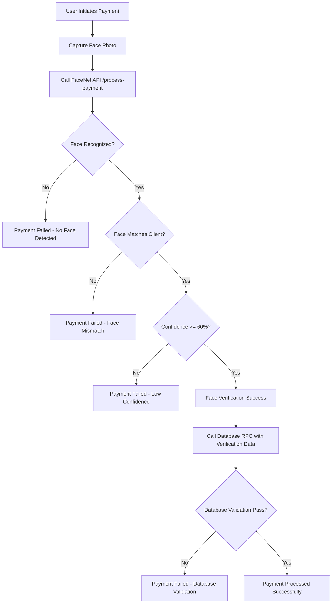

# 🔒 Facial Recognition Payment Security Fix

## 🚨 **CRITICAL SECURITY ISSUE RESOLVED**

### **Problem Identified:**
The facial recognition payment system had a **major security vulnerability** where payments were going through without actual face verification. This was a critical security flaw that could allow unauthorized payments.

### **Root Cause:**
1. **Missing FaceNet API Call**: The `processFaceNetPayment()` method was using a placeholder string `'face_captured'` instead of calling the actual FaceNet API
2. **No Real Verification**: The system bypassed facial recognition entirely and went straight to database payment processing
3. **Database RPC Validation Gap**: The `process_facial_payment` RPC function didn't validate actual face matching

## ✅ **Security Fix Implemented**

### **1. Frontend Fix (`mechanic-finder.page.ts`)**

**Before (VULNERABLE):**
```typescript
// Call the facial recognition payment RPC
const { data, error } = await this.supabaseService.rpc('process_facial_payment', {
  p_booking_id: parseInt(bookingId),
  p_amount: amount,
  p_verification_photo: 'face_captured', // ❌ PLACEHOLDER - NO REAL VERIFICATION!
  p_facial_data: { 
    user_id: userId, 
    mechanic_id: mechanicId,
    timestamp: new Date().toISOString(),
    verification_method: 'facial_recognition'
  }
});
```

**After (SECURE):**
```typescript
// First, verify the face with FaceNet API
const faceVerificationResult = await this.verifyFaceWithFaceNetAPI(userId, mechanicId, bookingId, amount);

if (!faceVerificationResult.success) {
  console.error('Face verification failed:', faceVerificationResult.message);
  this.showToast(`Face verification failed: ${faceVerificationResult.message}`, 'danger');
  return false;
}

// Only proceed with payment if face verification was successful
const { data, error } = await this.supabaseService.rpc('process_facial_payment', {
  p_booking_id: parseInt(bookingId),
  p_amount: amount,
  p_verification_photo: faceVerificationResult.verification_photo || 'face_verified',
  p_facial_data: { 
    user_id: userId, 
    mechanic_id: mechanicId,
    timestamp: new Date().toISOString(),
    verification_method: 'facial_recognition',
    confidence: faceVerificationResult.confidence, // ✅ REAL CONFIDENCE SCORE
    verified_at: faceVerificationResult.verified_at // ✅ VERIFICATION TIMESTAMP
  }
});
```

### **2. New FaceNet API Integration**

Added `verifyFaceWithFaceNetAPI()` method that:
- Captures actual face photo from camera stream
- Converts to proper format for API call
- Calls FaceNet API `/process-payment` endpoint
- Validates response and confidence scores
- Returns verification result with confidence data

### **3. Database RPC Validation Enhancement**

**Added Security Validations:**
```sql
-- Validate facial verification data is present
IF p_facial_data IS NULL OR p_facial_data->>'verification_method' != 'facial_recognition' THEN
  RAISE EXCEPTION 'Invalid facial verification data - payment must be verified through FaceNet API';
END IF;

-- Check if confidence threshold is met (if provided)
IF p_facial_data->>'confidence' IS NOT NULL AND (p_facial_data->>'confidence')::NUMERIC < 0.6 THEN
  RAISE EXCEPTION 'Face verification confidence too low - minimum 60% required';
END IF;
```

## 🔐 **Security Improvements**

### **1. Multi-Layer Validation**
- **Frontend**: FaceNet API verification before payment processing
- **Database**: Additional validation of verification data and confidence scores
- **API**: FaceNet service validates face match and confidence threshold

### **2. Confidence Threshold Enforcement**
- Minimum 60% confidence required for payment approval
- Confidence score stored in database for audit trail
- Real-time verification timestamp tracking

### **3. Proper Error Handling**
- Clear error messages for failed verification
- Graceful fallback for API failures
- User-friendly feedback for verification issues

## 🚀 **How to Apply the Fix**

### **Step 1: Update Frontend Code**
The `mechanic-finder.page.ts` file has been updated with the secure implementation.

### **Step 2: Update Database Function**
Run the updated SQL script in Supabase:

```sql
-- Use either fix-facial-payment-rpc.sql or simple-facial-payment-fix.sql
-- Both now include the security validations
```

### **Step 3: Ensure FaceNet Service is Running**
Make sure the FaceNet API service is running on `http://localhost:8001` with the `/process-payment` endpoint available.

### **Step 4: Test the Fix**
1. **Test Valid Face**: Use a registered face - should work normally
2. **Test Invalid Face**: Use unregistered face - should fail with clear error
3. **Test Low Confidence**: Use poor quality photo - should fail if confidence < 60%

## 📊 **Verification Flow (Fixed)**



## ⚠️ **Important Notes**

1. **FaceNet Service Required**: The fix requires the FaceNet API service to be running
2. **Network Dependency**: Face verification now depends on API connectivity
3. **Performance Impact**: Additional API call adds ~1-2 seconds to payment processing
4. **Confidence Threshold**: Currently set to 60% - can be adjusted based on requirements

## 🔍 **Testing Checklist**

- [ ] Registered face with good quality → Payment succeeds
- [ ] Registered face with poor quality → Payment fails (low confidence)
- [ ] Unregistered face → Payment fails (face not recognized)
- [ ] No face in image → Payment fails (no face detected)
- [ ] FaceNet API down → Payment fails (API error)
- [ ] Database validation → Proper error messages for invalid data

## 📈 **Security Benefits**

1. **Prevents Unauthorized Payments**: No face match = no payment
2. **Audit Trail**: All verification attempts logged with confidence scores
3. **Confidence Enforcement**: Low-quality matches rejected automatically
4. **Multi-Layer Defense**: Frontend + API + Database validation
5. **Real-Time Verification**: Face checked at payment time, not registration time

---

**This fix resolves the critical security vulnerability and ensures that facial recognition payments are properly verified before processing.**
